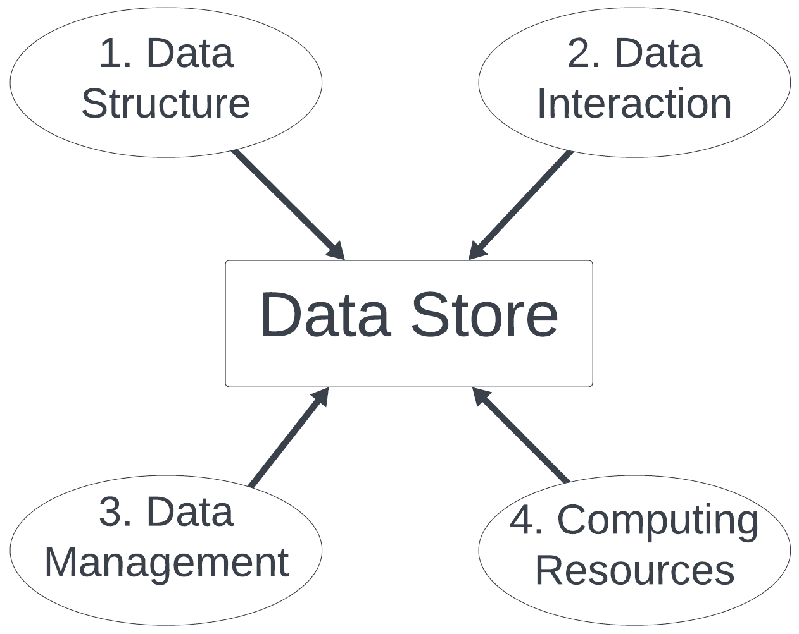

# Data Storage Considerations

{width="80%"}

When deciding on a method for storing your data (a data store), you have many
options. While none of the options will likely be perfect, some are undoubtedly
more suited to your situation than others. In order to figure out which data
store will best suit your needs, it is important to consider your data's
structure, the ways you anticipate interacting with your data, your data
management needs, and the computing resources you have access to.

## Data Structure

Your data's structure describes how your data is organized. While the same
information *can* be encoded in multiple data structures, certain types of
information tend to lend them selves to certain data structures. Additionally,
different data structures can make it easier or harder to ask specific research
questions. Many data stores impose structure on the data they store. To make
your life easier, choose a data store whose structure aligns with the types of
research questions you want to ask.

### Key Questions

- What types of research questions will I ask?

## Data Interaction

Generally speaking, collecting data is only an early step on the road to
scientific discovery. Once you collect data, that often needs to be cleaned and
reformatted before it can be analyzed. Sometimes you have to repeat this process
many times, either for different groups of data, or for different types of
analysis. In many cases, you may not need all of your data to answer every 
research question. Some data stores have built in tools to make data 
manipulation faster, easier, and reproducible. If you spend a lot of time 
reformatting your data, consider a data store that has this functionality.

### Key Questions

- What kinds of analysis will I do?
- How does my data need to be formatted?

## Data Management

Data management concerns the logistics of working with data. It encompasses 
the challenges of people (including you) interacting with your data over time and space. 

Even if you are the only person who will ever interact with your data, data
management is still something to consider. If you collect or modify your data
over time, you need to make sure you keep track of those changes, and make sure
you are always working with the most up to date version of your data. This could
be because you are adding new data or correcting errors in older data. This is
doubly important if data gets entered by hand. Some data stores keep track of
changes to your data for you and even provide some quality control tools. Others
require you to do track versions of your data and do quality control on your
own.

However, science is a collaborative process, so it is more than likely you won't
be the only one working with your data. Any time more than one person needs to
access or modify a data set, data management gets more complicated. By default,
most computers only allow one person to modify a file at a time, and anyone who
has access to that file can edit it. Some data store software has methods for
dealing with the conflicts or inconsistencies in data that come from allowing
multiple people to modify data so you don't have to.

Finally, there will come a time when you move on to other projects. If other
people still need to use your data, or if your data is part of a public resource
you may need to select or change to a data store that is publicly accessible or
can be maintained by other members of the project team.

### Key Questions

- When and how is the data collected?
- Who needs access to it? one or more people?
- How long does the data need to persist?

## Computing Resources

Data set size can vary widely. A data set containing information about patients
of an early stage drug trial may only contain a few dozen observations. On the
other side of the spectrum web scraping social media sites can easily generate
terabytes or petabytes of data. Different types of data store software have
different limits in terms of how much data they can accommodate. Additionally,
some software is free for small data sets, but costs money to use for larger
ones. UC Davis provides free or discounted software licenses to researchers.
Your lab also may have access to software or data storage specific to your area
of study. Finally, if you work with data that contains sensitive information,
like medical data, you will need to make sure the data store you select is
sufficiently secure.

### Key Questions

- How much data do I have? Is any of it sensitive?
- Do I have access to external or shared storage space?
- What software to I have licenses for?
