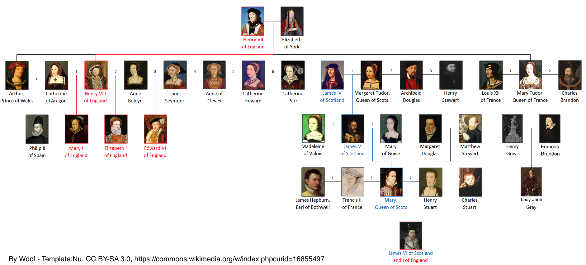
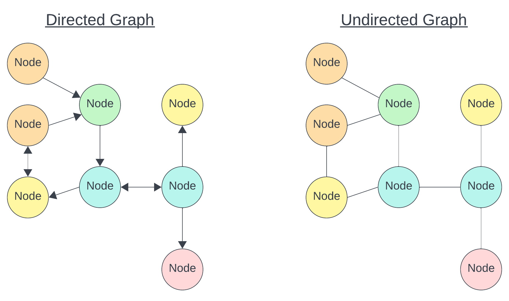
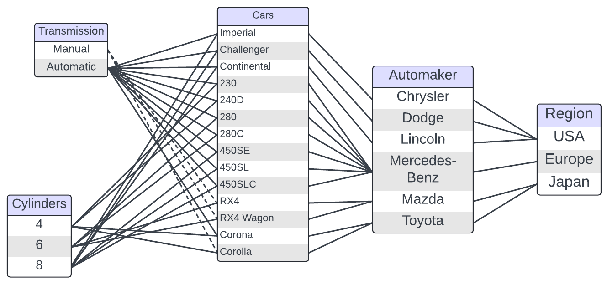

# Data

> Data (noun): Quantities, characters, or symbols...considered collectively.
>
> \- Oxford English Dictionary


<!--
Information becomes data when it takes on a structure.

some data has a structure that is inherent to the information
Data is actionable, either by humans or by computers by putting it in some sort 
of structure (including natural language: syntax and grammar), text isn't 
unstructured it just hasn't been restructured to make it actionable

two structures; inherent structure and structure we impose on the data
The process of (re)structuring data is at least as important as the analysis 
we do afterward.

Things inform your data structure: inherent structure in data, and the question
you want to ask?

Ex you might throw the structure away ex with a lot of LLMs through the grammatical
structure away.

You will almost always have multiple versions of data in different structures
so you can ask different questions

Note: there are other definitions of data structure from other disciplines
(ex. in comp sci), we will not be using those definitions
-->

If you are doing research, chances are you are going to be working with data in
some form or another. Even if you do not use traditional rows and columns, you
are certainly working with some form of information. And if you have translated
information into a form that is more easily shared or stored for later use, you
are working with data. Information becomes data when we give it some sort of
structure. That could be the rows and columns of a table, or something more
human readable, like the grammar and syntax of natural language in text form.

One of the challenges of working with data is figuring out a useful way to store
it. Thankfully, we have mostly left behind the 20th century's favorite way of
storing data: paper in filing cabinets. Modern digital methods definitely take
up less space but also have a higher barrier to entry. There are many more types
of data stores available now as well. This means you will need to make a
decision on which one to use. **Ultimately, the best way to store your data**
**will depend on the data you want to store and the questions you want to ask**
**with it.**

When describing data, we generally talk about two main characteristics: data
type and data structure.

## Data Types

Your data's type tells the computer what sorts of operations make sense. Common
data types include:

-   integers
-   decimal
-   floating point numbers
-   categories (small, medium, large)
-   characters (text)
-   Boolean values (TRUE and FALSE)
-   dates and times

All data, including individual data points, have a type. However, a given piece
of information can be stored using multiple data types. For example, you can
store the value of 1 as the integer 1, the decimal 1.0, the text "1", the
Boolean TRUE, or the date 1900-01-02 (days after January 1, 1900). The
underlying information is the same (1), but the computer will treat each of
these pieces of data differently. It will not allow you to add "1" to another
number, and it may have issues combining the integer or decimal 1.0 with text.
Text itself can only be stored as characters.

## Data Structures

> A data structure is a collection of data values, the relationships among
> them, and the functions or operations that can be applied to the data.
>
> Wikipedia

Unlike with data types, a single piece of data cannot have a data structure.
This is because data structure is about capturing relationships between data
points. We will discuss four of the most common data structures:
tabular/columnar, graph, tree, and spatial data. In practice, data often
exhibits traits from multiple data structures.

Data is information translated into a form to store for later use. The type of
information you work with does not dictate the type of data structure you must
use. However, some types of information lend themselves to particular data
structures over others.

When trying to decide what data structure to use to represent information from
your research, the key is to focus on what sorts of questions you would like to
ask. Each data structure will make answering some types of questions easier or
harder. If you want to ask disparate types of questions, you may need to
represent your data using multiple structures. Because data structure has such
a large impact on how you interact with your data, the structure you choose is
just as important as the analysis you do afterward.

### Columnar/Tabular

```{r format_cars, echo=FALSE}

makers = c('Mazda', 'Merc', 'Toyota', 'Ferarri', 'Lincoln', 'Chrysler', 'Dodge')
origins = c(rep('Japan', 2), rep('Europe', 7), rep('Japan', 2), rep('USA', 3))


maker_ids = sapply(makers, grep, rownames(mtcars)) |> 
  unlist(use.names=FALSE) |>
  unique()

mpg = mtcars[maker_ids, c('mpg', 'cyl', 'hp', 'wt', 'am')]

rownames(mpg) = gsub('Merc', 'Mercedes-Benz', rownames(mpg))
mpg$origin = origins

names(mpg) = c('mpg', 'cylinders', 'horsepower', 'weight', 'manual', 'origin')

```

Tabular or columnar data is made up of rows and columns, collectively referred
to as a table. By convention, each row represents an observation, and each
column a measurement or aspect of that observation. Tabular data is incredibly
common, especially in the sciences. Many researchers, regardless of field store
at least some of their data in tabular form. Tables work well when all of the
objects in your study can be summarized with the same set of characteristics.
Many study designs require this, which is one of the reasons why tabular data
is so common. 

The table below contains data from the US magazine *Motor Trend* in 1974
[@mt_cars]. In the table below, each row is an observation of a car model released
between 1973 and 1974. The magazine recorded the make, model and origin of each
car and measured the car's fuel efficiency (mpg), horsepower, weight, and number
of cylinders in the engine.

-------------------------------------------------------------------------------

```{r, echo=FALSE}

library(kableExtra)

mpg_cap = paste("A subset of the `mtcars` data set, containing information",
                "about 32 cars from the 1974 *Motor Trend* Magazine.")

kbl(mpg, caption = mpg_cap) 

```

Other examples of data sets that lend themselves to a tabular data structure
include California almond yields (lb/acre) for farms around the state, climate
data over the past 50 years, snow accumulation (inches) for Lake Tahoe, and
biomarkers for people participating in a study on a chronic illness.

Tabular data lends itself to answering questions about the average value or
spread of a particular measurement over the entire data set. It can also help
investigate trends in a particular variable, or how two variables relate to
each other. In the case of the car fuel efficiency data, we could ask about the
relative fuel efficiency of cars from different parts of the world or if there
is any relationship between a car's weight and its horsepower. The tabular data
structure also makes sorting observations very easy.

#### Example Research Questions

**General Research Questions**

-   What is the average value of a particular measurement across a data set?
-   What is the range or spread of values in a data set?
-   Are there trends in the values of a variable?
-   How to two columns in a data set relate to each other?

**Topic Specific Examples**

-   What is the is the average yield (lb/acre) for California almond farms?
-   What is the normal range of values for a vitamin A blood test in humans?
-   Have summer temperatures increased in the Bay Area, and if so, by how much?
-   Are there compounds present in blood we can use to detect rabies in urban
    wildlife?

### Trees

Trees are another commonly used data structure. Tree structured data explicitly
capture hierarchical relationships between entities. Trees are made of up nodes
(or vertices) which represent entities in the data, and edges which represent
relationships between those entities. The number of edges separating an entity
from a common root node defines that entity's place in the hierarchy. When
viewing tree structured data on a computer, it often looks very "nested", like
sections and subsections of a document. In fact, tree data is sometimes
referred to as document structured data because of this.

*Figure 3.1. An generic example of tree structured data. Intersections are
labeled as nodes and the nodes are connected with edges.*

<center>{width="50%"}</center>

In general, tree data facilitates asking questions about particular subsets of
the data. For example, you might want to know how closely two entities are
related, which branches of the tree have the most nodes, or all of the
observations that fall under a particular subtree.

Family trees are a common example of tree structured data. In family trees, the
nodes represent people in the family. Horizontal lines represent marriages or
couplings, and vertical lines represent a connection to offspring. In the
family tree of the Tutor Dynasty in England below [@tudor], it is easy to determine
things like who had the most wives (Henry VIII), which people shared a
generation, and who was the last member of the dynasty (James I of England).
Questions like what was the average age at death for the Tudors would be harder
to answer.

*Figure 2.2. Family tree of the principal members of the house of Tudor in 
England. Red indicates monarch of England. Blue indicates monarch of Scotland.*



We can also represent the car fuel efficiency data with a tree data structure.
This makes it much harder to answer some of the questions mentioned in the
previous section. On the other hand, the tree structure makes it very easy to
see which car manufacturer produced the greatest number of models in 1973-74
and how many different models came out of Japan during that time period.


*Figure 3.3. A tree representation of the subset of the `mtcars` data set
displayed in Table 3.1.* 


#### Example Research Questions

**General Research Questions**

-   How many nodes separate two entities?
-   Which elements fall under a particular subtree?
-   Text or directory searching

**Topic Specific Examples**

-   Are elephants more closely related to sloths or rhinoceroses?
-   How many species of dinosaurs were there and are there any alive today?
-   Which journals published the most articles mentioning AI this year?

### Graphs

Graph data, also called network data, is similar to tree data in many ways. It
also explicitly captures information about relationships between entities using
nodes and edges. However, unlike trees, graph data sets have no inherent center
or root node, and there is no implicit hierarchy or nesting. Additionally, the
relationships between the vertices can be directional, and that direction does
not have to be consistent throughout the graph.

*Figure 3.4. Two examples of generic graph data, one a directed graph and one
and undirected graph. The directed graph has arrows connecting the nodes, while
the undirected graph simply has lines.*

<center>
{width="75%"}
</center>


Graph structured data tends to be more common in the social sciences and
humanities. A common example of a graph in popular culture is a social
network. Transportation data, like roads and flight paths, also lend themselves
to the graph structure. In the digital world, we can use graphs to map out the
link connections between Wikipedia pages, as seen below with Abraham Lincoln 
[@wqs].

*Figure 3.5. A graph of relationships between Abraham Lincoln's Wikipedia page
and other pages linked to it. Each linkage contains a label describing the 
relationship between the two pages*


Graphs make it easy to ask questions about connectivity. For example we might
want to know how many flight connections we will need to make between Honolulu,
Hawaii and Cairo, Egypt, or how many degrees of separation there are between
Abraham Lincoln and Kevin Bacon on Wikipedia. We can also ask about which parts
of the graph are the most connected and which are the least connected.

 <!--
 https://ucdavisdatalab.github.io/workshop_network_viz/index.html
 - Characteristics of the nodes 
 - questions you can ask about the edges
 - network as a whole
    - structure of the network
    - exogenous (questions about additional data)
    - Liza's ggraph presentation (one or two modes)

multiple networks of the same data/situation
-->

#### Example Research Questions

**General Research Questions**

-   How many edges separate two entities?
-   How many paths are there between two nodes?
-   Which parts of the graph are most or least connected?

**Topic Specific Examples**

-   How many flight connections needed to fly between Honolulu, Hawaii and
    Cairo, Egypt?
-   Would adding a public transit line between San Francisco and Santa Rosa
    relieve highway congestion?
-   Which jobs in a hospital will most likely expose you to COVID?

### Relational Data

In relational data, also called category or group membership data, the
organizing principle is group membership. Each group in the data structure
has a list of members. Those members can then be linked to members of other
groups. For example, Alice is a member of the group "Students". She is 
linked to Davis in the "Hometown" group, indicating she is from Davis. She 
is also linked to Cell Biology in the "Majors" group and Club de Español and
PreMed Mentorship in the "Clubs" group. 

*Figure 3.6. A relational diagram of characteristics of fictional first year 
students at UC Davis.*

{width="140%"}
</center>

This data structure has some similarities to graph and tree data. Both tree data
and relational data share some level of nestedness in their data structure.
However, for tree data every relationship is a nested relationship. By contrast,
with relational data, entities can be a part of a group, but they can also be
linked to entities in other groups in a non-hierarchical way. Like in graph
data, relationship connections link entities in relational data. However, those
entities are also nested in groups, something that isn't captured in graph data.
Additionally, neither graph nor tree data allows entities to appear multiple
times in a data set. However, that is exactly what you see in Figure 3.6. Alice
and Casey are members of both the "Students" group and the "Club Leadership" 
group. This helps capture the multifaceted-ness of some entities, like people!

Like we did in the Tree Data section, we can structure the `mtcars` fuel 
efficiency data set in a relational diagram. This doesn't give us much more 
more information than we had with previous structures. In fact, there is a lot 
of information we had to leave out because it couldn't be captured in the
relational structure. Specifically, the relational structure does not handle 
numeric data well. Because of this, researchers often combine relational data
with other data structures in practice.

*Figure 3.7. A relational representation of the subset of the `mtcars` data set
displayed in Table 3.1.*

<center>{width="100%"}</center>


#### Example Research Questions

**General Research Questions**

-   Which groups are the largest or smallest?
-   Do certain memberships tend to co-occur?
-   How many groups does an entity tend to belong to?

**Topic Specific Examples**

-   Which US state has the most government agencies related to health and 
    medical care?
-   Do students majoring in Environmental Science and Management tend to join 
    student groups related to outdoor recreation?
