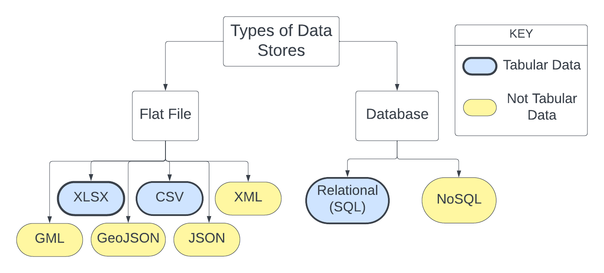
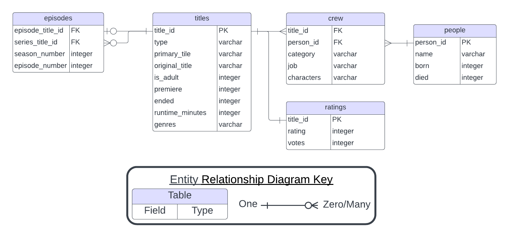

# Data Stores

> A data store is repository for persistently storing and managing collections
> of data which include not just repositories like databases, but also simpler
> store types such as simple files, emails etc.
>
> Wikipedia

Once you have decided on a data structure, the next decision to make is what
type of data store to use for data storage. A data store is a repository for
storing and managing data. While this workshop covers exclusively digital data
stores, for most of human history, data stores were analog. Even today, we
still use analog data stores like libraries, museums, and filing cabinets. Data
stores have two primary functions. First, they need to facilitate people
accessing the data (reading) and making changes to it (writing). Second, they
need to preserve this access over a period of time.

## Data Store Definitions

**Data Store:** Where your data is saved and how you interact with it.

**GUI:** Graphical User Interface, a software application that allows you to
interact with the computer via icons, buttons, and windows. Often referred to in
contrast to a command line interface which only allows you to interact with the
computer through text commands.

**Query:** commands that create, read, update, or delete information from a data
store, generally entered through a command line interface.

**Transaction:** the unit of work in a data store. Ideally a transaction 
succeeds or fails as a unit.


## Types of Data Stores

Regardless of your data's structure you have two general options for how to
store your data digitally: in flat files using a GUI or in a database.


*Figure 4.1: A tree diagram enumerating different ways of managing your data,* 
*in part based on the data structure.*

{width="80%"}

Probably the most common type of data store is a flat file. A **flat file** is
stand alone file on your computer that is not linked to data elsewhere. You can
store tabular data in .xlsx and .csv files, tree data in .xml and .json files,
and graph data in .GML and .DOT files. Generally, people interact with data
stored in flat files via a GUI. Most GUIs are specific to file type or data
structure. For example, spreadsheet applications like Microsoft Excel or Google
Sheets can edit xlsx and csv files, and applications like Graphviz can visualize
and modify DOT files.

In comparison, a **database** is an organized collection of data that is linked
or related in some way. Users interact with a database through specialized
software called a database management system, often abbreviated DBMS. Most
databases do not have a GUI. This means you will be interacting with the
database through a query language instead of clicking on buttons. If you already
use a programming language like R or python, this will be very familiar to you.
If not, don't worry. Query languages, like SQL, are designed to be simpler and
easier to use than most programming languages, but also incredibly powerful.


Database management systems have several advantages accessing flat files with a
GUI.

1.  **Structure** - Databases can store data with structures ranging from low
    to high complexity.

2.  **Interaction** - Database queries make data interaction and formatting 
    reproducible. If you use the same query on the same database, you will 
    get the same result.
    
3.  **Management** - Databases allow multiple people to interact with data 
    at the same time without locking people out or introducing conflicts. They 
    also provide fine-grained controls on who can access, modify, and delete 
    data.

4.  **Computing Resources** - Many GUIs have fairly restrictive size limits on
    how big a file can be. Databases do not generally have these 
    restrictions, or if they do, the size limit is much higher.

Databases can also formalize some processes that should be done on flat files
but often are not. The first of these is version control. When working with data
it is vitally important to define which version of the data is the correct and
up to date. This is particularly important when multiple people have the data
stored locally on their computers. Databases provide a definitive version of the 
data that users can access remotely. This ensures that everyone working on a 
project uses the same data.

The second is administration. Because databases can set controls over who has
access to what, you can control who has the ability to add data to and modify
the database. You also need to designate someone to be in charge of fixing 
things if something in the database breaks. This is also true for flat files but
because everyone has the same access it is often not clear whose job it is.

Some databases also provide tools to prevent mistakes and maintain data
integrity. This includes restricting data to specific data types or specific
sets of values. This means if you type a "w" instead of a "2", the database will
tell you to check your data and try again. 

If you are running into any of the following issues, a database may be the
solution to your problems.

-   Your data set has many repeated values

-   Your data set contains information about many unrelated or loosely related
    studies

-   You are sharing data with multiple people and everyone seems to have a
    different version

-   Your data set is so large, your computer slows down or freezes when trying
    to view it

-   You have to keep making the same corrections to your data over and over
    again

-   Excel keeps converting your columns to the wrong data type

-   You have so many pivot tables

-   You have hundreds (or thousands) of data files you need to share with your
    collaborators

-   You think PowerQuery is neat but wish people would stop changing the
    underlying data while you are using it.

-   You have a hard time finding and extracting the information you need to
    answer a particular research question

-   Processing your data requires you to spend a lot of time moving data
    between spreadsheets by hand.

## Spreadsheet Software

Using spreadsheet software with tabular data files is very a common form of
digital data store. If you have used Microsoft Excel or Google Sheets, you have
used spreadsheet software. Like some databases, spreadsheets impose a tabular
data structure on the data they store. Despite this, a spreadsheet is not a
database. Like most modern software, spreadsheet applications have graphical
user interfaces, making the barrier to entry very low. Spreadsheet software also
offers some built in analysis tools, so you don't have to learn a new
application to do basic statistics and data visualization.

Spreadsheet software also suffers from some drawbacks. They offer limited
storage capacity, making it difficult to work with large data sets. Excel and
LibreOffice have a maximum row number of a little over 1 million and Google
Sheets limits you to 10 million cells. Software operations will also slow down
if you get close to their data capacity. This means analyzing large data sets
is much more tedious than analyzing small ones.

Spreadsheets also store data in ways that cause a lot of data duplication and
make data entry susceptible to typos. In the spreadsheet visualized below, we
have data on the Die Hard movie franchise [@imdb]. Specifically, we have
information about the actors that starred in the series and the movies in which
they appeared.

```{r, echo=FALSE}
# class.output="scroll-300",

library(data.table)
library(kableExtra)

dh = fread('data/die_hard.csv', header=FALSE)
setnames(dh, names(dh),
         c('title_id', 'person_id', 'title', 'premiered', 
           'runtime', 'genres', 'rating', 'votes', 'name', 'birth',
            'death', 'role', 'characters'))

dh_cap = paste("Information from IMDB about the Die Hard movie franchise and",
               "the people who acted in those films.")

dh = dh[,.(title_id, person_id, title, name, characters, premiered,
           runtime, genres, rating, votes, birth, death, role)]

kbl(dh, caption=dh_cap) |>
  scroll_box(width = "100%", height = "400px")

```

Looking at the last three columns, there is a lot of data duplication, meaning
our data set takes up more space on our hard drive than it needs to.
Additionally, if we have to change the information about a single movie or
actor, we would have to make that change in many different places, and
potentially miss one or make a mistake. If we accidentally left out an "l" in
Bruce Willis's last name, we would have to modify five cells to fix our data.

Finally, most spreadsheet applications make it difficult to work with multiple
people on a single data set. Generally, GUIs only allow one person to edit a
file at a time, and setting user permissions is cumbersome. They also make it
easy to collect many versions of a given data set. So unless you are diligent
about naming, you may end up with people working on different different versions
of your data. Google Sheets offers shared access and some version control, but
still fails to deliver on storage capacity, and data integrity.

### Spreadsheet Software Decision Factors

1.  **Structure:** tabular
2.  **Interaction:**
    - Graphical User Interface
    - Some offer built in analysis and visualization tools
    - reformatting is hard
3.  **Management:**
    - Managing multiple users is challenging
    - Easy to introduce typos or erros when adding data
4.  **Computing Resources:**
    - Software is easy to use and widely available
    - GUI limits data size
    - Lots of data duplication makes data larger

### Examples

-   Microsoft Excel
-   Google Sheets
-   Numbers
-   LibreOffice Calc
-   OpenRefine
-   Open Science Framework

## Relational Database Management System

Relational Database Management Systems (RDBMSs), or relational databases, are
one type of database. When people use the word "database", nine times out of
ten they are referring to a relational database. Like spreadsheets, RDBMSs
impose a tabular structure on the data they contain. A basic RMDBS is a 
collection of tables connected by shared columns called keys. However, they can
be more complex.

Users often interact with an RDBMS through the Structured Query Language (SQL)
instead of a graphical user interface, though there are exceptions. SQL is a
programming language, but it is one specifically designed for interacting with
relational databases. SQL standardizes your interactions with a database, and
makes them reproducible. This means it is much easier to ensure everyone is
working with the same set of data. Working with SQL is a skill, and will take
some time to acquire. However, because of SQL's narrow scope, is easier to
learn than a more complex programming language like python or R.

To learn about using SQL in practice, check out DataLab's Intro to SQL
([reader](https://ucdavisdatalab.github.io/workshop_intro_to_sql/), workshop)
and Spatial SQL ([reader](https://ucdavisdatalab.github.io/Spatial_SQL/),
workshop) resources.

### Relationship keys

A relationship key is a column or pair of columns that links two tables. One
example of a relationship key you may use is a student or employee ID number.
You can use that number to link information about you in one part of the
University to another part of the University. This is what allows you to pay
for meal plans via the Student Accounting department and you can use your meal
plan through Dining Services. The student ID number ensures that the money you
spend gets credited to the correct account.

There are two types of relationship keys: primary keys and foreign keys. A
primary key, sometimes called an index, is a column that uniquely identifies
each row in a particular table. It is generally the first column in the table.
A foreign key is a column in one table whose values correspond to a primary key
in another table. Student ID would be a primary key in a table that lists all
of the students at the university with some basic information about them. It
would be a foreign key in a table that lists all food and beverage sales at a
particular on campus eatery.

### Entity Relationship Diagrams

An Entity Relationship Diagram (ERD) provides a visual summary of of the
information in a database without needing to interact with it. ERDs are a
standardized way to depict the structure of a relational database. Each box in
the diagram represents a table, with the table title at the top and the column
names listed below it. The column data type appears next to each column name.

Connector lines link primary/foreign key pairs. These lines specify which
tables can be combined, and which keys should be used to combine them. The
connector lines also specify what type of relationship between the two tables.

*Figure 4.2. A partial Entity Relationship Diagram for the IMDB non-commercial
database [@imdb; @sql_imdb].*



The first type of relationship is a one-to-one relationship. Two tables are
one-to-one when one observation in table A only corresponds to one observation
in table B. This is the relationship between the titles and ratings tables in
the IMDB database. The next type of relationship is a one-to-many relationship.
In this case, one row in table A may be linked to many rows in table B. This is
the relationship between the title and crew tables in the IMDB database.

Finally, there is the many-to-many relationship. In this case more one row in
table A can correspond to multiple rows in table B AND one row in table B can
correspond to multiple rows in table A. The classic example of this is cities
and zip codes. Many cities contain more than one zip code, but some zip codes
also span multiple cities.

### Why Use Relational Databases?

There are four primary reasons to use a RDBMS as a data store:

1.  Reduce data duplication

2.  Speed up and standardize accessing and updating the database

3.  Ease of reformatting data

4.  Ensure data integrity

In our Die Hard movie spreadsheet example, we had 260 cells. However, in a
relational database, storing that same data only requires 156 cells. That is a
40% reduction in data size. For a multi-gigabyte data set, 40% makes a huge
difference. Additionally, much of that information was stored as numbers
instead of text, which makes its size on even smaller. Finally, we selected a
subset of columns from each table, which means we didn't need to work with ALL
of the data just because we wanted to work with some of it. Subsetting like
this is much harder in traditional spreadsheet software.

The source database of our Die Hard data, IMDB, is massive relative to
spreadsheet software capabilities. The titles table alone has 10 million
observations, and the crew table has over 60 million. Despite this, extracting
the Die Hard movie franchise information using an SQL query took about half a
second.

The SQL query used to extract the Die Hard data is also reproducible. If I want
to collaborate with a colleague on my analysis of Die Hard, I don't have to
send the data set to my collaborator. Instead I can provide them access to to
the IMDB database and my SQL query. If I find problems in the data at a later
time, I don't need to send a whole new data set, which could introduce
confusion about which data to use. All I need to do is update the database, and
tell my colleague to rerun their SQL query. No additional computer storage
necessary.

With an RDBMS, even though the data you analyze may have duplicates, you don't
need to modify each duplicate value, in the case that one requires a
correction. All changes to the data can be made to the singleton values in
their original tables. Correcting Bruce Willis's misspelled last name only
requires fixing his name once in the "people" table. Then, any time you extract
data from the database table, that change will automatically propagate to the
new data. While it may be easy to successfully fix 5 errors, it will be much
harder to fix 50, or 5,000. This is especially true if they are scattered
throughout your data set and not just in a single column.

Relational databases also have a built-in system for managing multiple people
interacting with the same data. Whenever someone submits a transaction to a
RDBMS, the database puts that transaction in a first come, first served queue.
If the transaction is successful, the entire database is updated and any future
transaction will work off the new data. If the transaction fails, nothing is
updated and the data stays as is for the next transaction in line.

### RDBMS Decision Factors

1. **Structure:** tabular, relational

2. **Interaction:** 

    - SQL (Structured Query Language)
    - Data manipulation is easy and reproducible

3. **Management**

    - Built in data quality control and multi-user management
    - Standardizes data updates
    - Provides definitive version of your data

4. **Computing Resources**

    - Fewer size restrictions
    - Requires some specialized setup
    - Thousands of transactions per day


### RDBMS Software

Because of relational databases' widespread utility, there are many software
options to choose from when creating a database. While all of them work off the
same basic SQL, each one puts its own particular spin on the language in terms
of additional functionality. All of the SQL database software options in the
table below have wide community and/or professional support. There are many
more RDBMS applications available for more specific use cases (ex. for use with
Amazon AWS), but these are the most common and widely supported. All of them
provide some level of support for spatial data. However, that level of support
varies, so if you have specific requirements, it's best to do additional
research before making a decision.

-------------------------------------------------------------------------------

```{r, echo=FALSE}

sql = read.csv('data/sql_software.csv')

sql_cap = paste("A comparison of some of the more common software",
                "implementations of SQL databases.")

sql_cols = c("Software", "Support", "Cost", "License", "Spatial Data")

kbl(sql, col.names=sql_cols, caption=sql_cap) 

```


## NoSQL Databases

Not Only SQL, or NoSQL, databases are another type of database. They are
primarily defined by what they do not do, namely they do not store data in
relational tables, as a RDBMSs would. Instead, NoSQL databases do not
necessarily impose external structure on the data they contain. In fact, NoSQL
databases can contain data from multiple structures, including

-   documents
-   key-value pairs
-   graphs
-   trees
-   wide column tables

This makes NoSQL databases are much better at storing tree and graph data, as
those data structures do not fit well into relational tables. Like RDBMSs,
NoSQL users interact with their database via a query language. However, the exact
one depends on the database software. This is in part because different data 
structures lend themselves to different types of operations.

### Why Use NoSQL Databases?

1.  Compatible with multiple, non-tabular, data structures

2.  Data transactions are much faster than other data stores

3.  Adding storage capacity is easier than for other data stores

One of the strengths of RDBMSs is that we can easily combine data from different
parts of the database using joins. However, functionality does come with a cost.
Using joins means relational databases must move a lot of data around, which can
slow down operations. Because NoSQL databases do not have this feature, they can
respond much faster to requests for information. While a RDBMS can support a few
thousand transactions per day, a NoSQL database can run millions of transactions
a day.

This lack of data joins also means NoSQL databases can also store data in
in many different locations without having it affect the database's response
time. This means a single NoSQL database could run on just as easily multiple 
on multiple machines as one machine. The practical implication of this is that
adding more storage space or processing power is much easier. You can add an
additional computer instead of needing to upgrade the one you already have. 

One common use case for NoSQL databases is for social network sites like
Facebook and Twitter/X. Social media contains a lot of text data that does not
fit neatly into the tabular structure mandated by relational databases.
Additionally, minimizing response time is critical for a company who wants to
convince more people use their website or platform. Finally, social media
generates massive amounts of data, which means companies like Twitter/X and Meta
regularly need to expand their storage capacity, something that is much easier
with NoSQL databases.

<!-- companies may switch to nosql as their computing needs grow -->

### NoSQL Decision Factors

1. **Structure:** documents, trees, graphs, key-value pairs, wide column tables

2. **Interaction:** 

    - Via various query languages
    - Data manipulation is easy and reproducible

3. **Management**

    - Multi-user management
    - Standardizes data updates
    - Provides somewhat definitive version of your data

4. **Computing Resources**

    - Fewer size restrictions
    - Requires some specialized setup
    - Millions of transactions per day

### Example Software

Not every NoSQL database supports every data structure. Some support multiple
structures while others specialize in one. They generally also low cost to
implement, though you can always pay for additional features and support.
Similar to RDBMSs, all the most common NoSQL database software provides some
support of spatial data. However, that support is limited to vector data and
the functionality available varies fairly widely.

```{r, echo=FALSE}

nosql = read.csv('data/nosql_software.csv')

nosql_cap = paste("A comparison of some of the more common software",
                "implementations of NoSQL databases.")

nosql_cols = c("Software", "Data Structure", "Query Functionality",
               "Transactions", "Cost", "Spatial Data")

kbl(nosql, col.names=nosql_cols, caption=nosql_cap) 


```

## Putting it all together

Now we know what our options are regarding data structures and data stores. Next
we will combine this information to make decisions!
