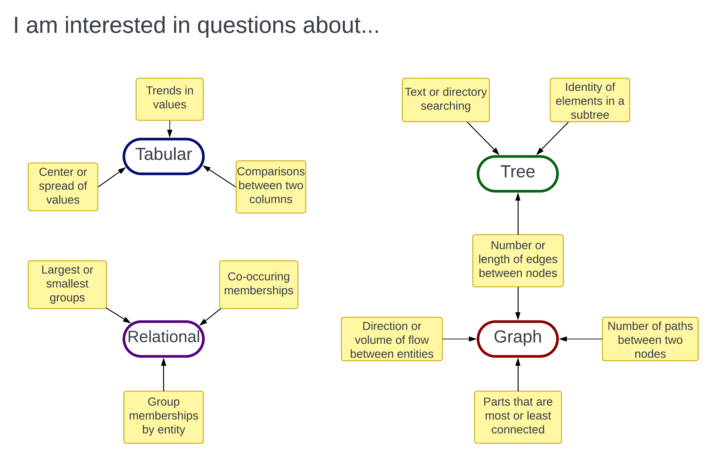

# Choosing the Right Data Store

You've just learned a bunch of information about data structures and data
stores. Now the challenge is applying that information to your own data. 
Remember the four factors to consider when deciding on a type of data store:

1. Data Structure

2. Data Interaction

3. Data Management

4. Computing Resources

## Decision Flow Charts

While each factor compasses a wide range of considerations, the flow charts
below can act as a starting point for deciding on the best data store type
for your research. 

You may find that various parts of your data require different answers to the
questions in these decision charts. Or, your answers to the questions may change
over time. You may want to ask different questions of your data, and therefore
need to change how you structure your data. You may start working with more
collaborators and need provide other people access to your data. Reproducibility
experts will sometimes assert that you only store one "definitive" version of
your data. However, that plan rarely survives first contact with a research
project. If you want understand a subject deeply, you need to ask many different
types of questions about it. And this necessitates storing your data in multiple
forms.

### 1. Data Structure {-}

-------------------------------------------------------------------------------

### 2. Data Interaction {-}

### 3. Data Management {-}

### 4. Computing Resources {-}

## Further Reading

This workshop is just the beginning. If a database seems like a good data store
for your current (or next) research project, the resources below can help you
get started.

### General Database Information {-}

-   [An Overview of Databases and Data Storage Reader][dl_db]

-   [Intro to Databases (for people who don’t know a whole lot about them)][medium]

-   [Database Management System (DBMS) Tutorial][g4gsql]

-   [Creating a database from scratch][create]

-   [NoSQL Explained][nosql]

-   [Introduction to NoSQL][g4gno]

### Learning Query Languages {-}

-   [Intro to SQL for Querying Databases Reader][dl_sql]

-   [Spatial SQL Reader][dl_ssql]

-   [W3Schools SQL Tutorial][w3sql]

-   [W3Schools PostgreSQL Tutorial][w3post]

-   [W3Schools MongoDB Tutorial][w3mongo]

### Campus Database Resources {-}

-   UC Davis DataLab [Office Hours][oh]:
    - Mondays, 1-2pm via Zoom
    - Tuesdays 1-2pm in person (Shields Library, room 360)

-   [Research Data Services][rds], 
    and the [research services librarians][email]
    
-   [Campus Data Services Catalog][cds]
    
-   [Research Data Management Topic Guide][rdm]

-   [UC Davis Cloud Services][cloud], includes Amazon Web Services,
    Microsoft Azure, and private cloud services
    
-   [Research Electronic Data Capture (REDCap)][redcap]

[dl_sql]:  https://ucdavisdatalab.github.io/workshop_intro_to_sql/
[dl_ssql]: https://ucdavisdatalab.github.io/Spatial_SQL/
[medium]: https://medium.com/@rwilliams_bv/intro-to-databases-for-people-who-dont-know-a-whole-lot-about-them-a64ae9af712
[rds]: https://library.ucdavis.edu/data-analysis-and-management/
[redcap]: https://health.ucdavis.edu/data/redcap.html
[rdm]: https://guides.library.ucdavis.edu/data-management
[cds]: https://servicehub.ucdavis.edu/servicehub?id=catalog&spa=1&sys_id=58cf6a65db87d09009ad5055ca96194d
[cloud]: https://cloud.ucdavis.edu/services-available
[email]: mailto:dataservices@ucdavis.edu
[w3sql]: https://www.w3schools.com/sql/
[w3post]: https://www.w3schools.com/postgresql/index.php
[w3mongo]: https://www.w3schools.com/mongodb/index.php
[nosql]: https://www.mongodb.com/nosql-explained
[g4gno]: https://www.geeksforgeeks.org/introduction-to-nosql/
[g4gsql]: https://www.geeksforgeeks.org/dbms/
[create]: https://interestingengineering.com/lists/build-a-database-part-1
[dl_db]: https://ucdavisdatalab.github.io/workshop_intro_to_databases/
[oh]: https://datalab.ucdavis.edu/office-hours/
